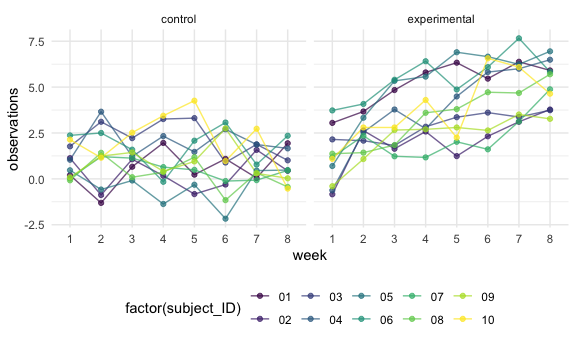

HW 5
================

``` r
library(tidyverse)
library(rvest)
library(lattice)

knitr::opts_chunk$set(
  fig.width = 6,
  fig.asp = .6,
  out.width = "90%"
)
theme_set(theme_minimal() +  theme(legend.position = "bottom"))

options(
  ggplots2.continuous.color = "viridis",
  ggplots2.continuous.fill = "viridus"
)

scale_colour_discrete = scale_colour_viridis_d
scale_fill_discrete = scale_fill_viridis_d
```

## Problem 1

Read in the data.

``` r
homicide_df = 
  read_csv("homicide-data/homicide-data.csv") %>% 
  mutate(
    city_state = str_c(city, state, sep = "_"),
    resolved = case_when(
      disposition == "Closed without arrest" ~ "unsolved",
      disposition == "Open/No arrest"        ~ "unsolved",
      disposition == "Closed by arrest"      ~ "solved",
    )
  ) %>% 
  select(city_state, resolved) %>% 
  filter(city_state != "Tulsa_AL") # data entry error =1, affter arrange we get rid of it 
```

Let’s look at this a bit.

``` r
aggregate_df =
homicide_df %>% 
  group_by(city_state) %>% 
  summarize(
    hom_total = n(),
    hom_unsolved = sum(resolved == "unsolved")
  )
```

Can I do a prop test for a single city?

``` r
prop.test(
  aggregate_df %>% filter(city_state == "Baltimore_MD") %>% pull(hom_unsolved),
  aggregate_df %>% filter(city_state == "Baltimore_MD") %>% pull(hom_total)) %>% 
  broom::tidy()
```

    ## # A tibble: 1 x 8
    ##   estimate statistic  p.value parameter conf.low conf.high method    alternative
    ##      <dbl>     <dbl>    <dbl>     <int>    <dbl>     <dbl> <chr>     <chr>      
    ## 1    0.646      239. 6.46e-54         1    0.628     0.663 1-sample… two.sided

Try to iterate…

``` r
results_df =
aggregate_df %>% 
  mutate(
    prop.tests = map2(.x = hom_unsolved, .y = hom_total, ~prop.test(x = .x, n = .y)), # x is number of success and n is total number
    tidy_tests = map(.x = prop.tests, ~broom::tidy(.x))
    ) %>% 
 # %>% pull(prop.tests) delete tidy_tests in mutate then do this
  select(-prop.tests) %>% 
  unnest(tidy_tests) %>%  #show the test tibble
  select(city_state, estimate, conf.low, conf.high)
```

``` r
results_df %>% 
  mutate(city_state = fct_reorder(city_state,estimate)) %>% 
  ggplot(aes(x = city_state, y = estimate)) +
  geom_point() +
  geom_errorbar(aes(ymin = conf.low, ymax = conf.high)) +
  theme(axis.text.x = element_text(angle = 90, vjust = 0.5, hjust = 1))
```


``` r
city_prop_test = function(df){
  n_unsolved...
  n_total...
  prop.test(...)
} ##amother way to solve this problem

homicide_df = 
  read_csv("data/homicide-data.csv") %>% 
  mutate(
    city_state = str_c(city, state, sep = "_"),
    resolved = case_when(
      disposition == "Closed without arrest" ~ "unsolved",
      disposition == "Open/No arrest"        ~ "unsolved",
      disposition == "Closed by arrest"      ~ "solved",
    )
  ) %>% 
  select(city_state, resolved) %>% 
  filter(city_state != "Tulsa_AL") %>% # data entry error =1, affter arrange we get rid of it 
  nest(data = resolved)
```

    ## Error: 'data/homicide-data.csv' does not exist in current working directory ('/Users/Anna/Desktop/P8105 data science/p8105_hw5_mb4757').

## Problem 2

take a look at 1 csv file

``` r
data_1 = read_csv("lda_data/con_01.csv")
```

make the tibble and tody the results

``` r
path_df =
tibble(
path = list.files("lda_data")
) %>% 
  mutate(
    path = str_c("lda_data/", path),
    data = purrr::map(.x = path, ~ read_csv(.x))) %>% 
    unnest(data) %>% 
  separate(path, into = c("path", "other"), sep= "/") %>% 
  separate(other, into = c("arm", "rest"), sep= "_") %>% 
  separate(rest, into = c("ID", "remain"), sep= 2) %>% 
  select(-path, -remain) %>% 
  filter(arm == "con")
```

make the spaghetti plot

``` r
results_df =
path_df %>% 
  pivot_longer(
    week_1:week_8,
    names_to = "time",
    values_to = "values"
  )

ggplot(results_df, aes(x=time, y=values, group = ID, color=factor(ID))) +
  geom_path(alpha = 0.7) + 
  geom_point(alpha = 0.7) +
  theme_bw()
```



## Problem 3

\[X_i \stackrel{i.i.d.}{\sim} Norm(0,5)\]

made a hypothesis function

``` r
hypothesis= function(sample_size = 30, mu, sigma = 5) { 
  sim_data = 
  tibble(
    x = rnorm(n = sample_size, mean = mu, sd = sigma)
  )
  
    t.test(sim_data, 
           alternative = "two.sided",
           mu = 0, paired = FALSE, 
           var.equal = FALSE, 
           conf.level = 0.95) %>% 
            broom::tidy() %>% 
      select(estimate, p.value)

}
```

case validation

``` r
hypothesis(30, 0, 5)
```

    ## # A tibble: 1 x 2
    ##   estimate p.value
    ##      <dbl>   <dbl>
    ## 1   -0.665   0.446

Create 5000 datasets for hypothesis test mu = 0 iteration

``` r
output = vector("list", length = 50)

for (i in 1:50){
  output[[i]] = hypothesis(mu = 0)
} 

bind_rows(output)
```

    ## # A tibble: 50 x 2
    ##    estimate p.value
    ##       <dbl>   <dbl>
    ##  1   -0.829  0.342 
    ##  2   -1.74   0.0606
    ##  3   -0.529  0.545 
    ##  4   -0.789  0.382 
    ##  5    0.628  0.363 
    ##  6    0.609  0.514 
    ##  7   -2.28   0.0122
    ##  8    1.26   0.164 
    ##  9    1.39   0.110 
    ## 10   -0.912  0.212 
    ## # … with 40 more rows

Create 5000 datasets for hypothesis test mu = 0:6 iteration

``` r
sim_results =
  tibble(mu = c(0, 1, 2, 3, 4, 5, 6)) %>% 
  mutate(
    output_lists = map(.x = mu, ~rerun (50, hypothesis(mu = .x))),
    estimate_df = map(output_lists, bind_rows)
    ) %>% 
  select(mu, estimate_df) %>% 
  unnest(estimate_df) %>% 
  rename(mu_hat = estimate)
```
